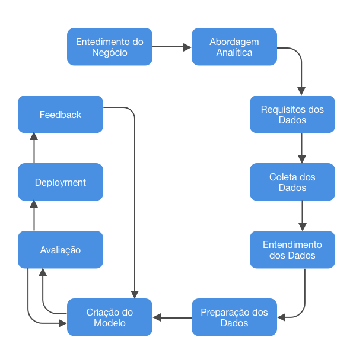

# Life time value predictor
---
Os dados que foram usados para este projeto podem ser encotrados [aqui](https://www.kaggle.com/datasets/shibumohapatra/customer-life-time-value?select=train_BRCpofr.csv)

A ideia por trás desse projeto era criar algo que eu acredite ser próxima de uma situação real.

Acredito que nesse projeto só ficou faltando a parte de requisitos dos dados e coleta. Já o feedback eu espero estar conseguindo de outras pessoas da área e assim irei melhorando o projeto conformeo passar do tempo.
___
## Modelo
Todos os passos que foram feitos com o objetivo de construir os modelos estão no arquivo [model_train](./model_train.ipynb)

Ele está divido por seções:
- Exploração (EDA)
- Pré-processamento / Feature Selection
- Escolha de modelo (Treinando modelos)
- Tunning

Na primeira versão deste projeto não cheguei em um modelo realmente efetivo. Em um caso real seria interessante solicitar mais dados ao cliente como por exemplo: ano do carro, marca, idade, histórico de acidente.
___
## Pipeline
Antes de colocar a API no ar é preciso que todos os processos que aconteceram para criação do modelo também ocorra nos dados que forem fornecidos para a API.
A criação desse pipeline pode ser visualizado no arquivo [pipeline](pipeline.py)   

Os passos que ela executam são:
- Converter json para um Data Frame
- Retirando colunas:
    - Vintage
    - Claim amount
    - ID
- Substituindo valores
    1. Genero: masculino = 0; feminino = 1
    2. Tipo de seguro: Silver = 0; Gold = 1; Platinum = 2
- Label encode: foi usado o OneHotEncoder nas seguintes colunas:
    - Area
    - Qualification
    - Income
    - Num policies
    - Policy
- Predição
- Retornando o Data Frame transformado

Escolhi retornar todo o DF trabalho para que fosse possível ver o resultado final completo.
___

## API
O código para construção da API pode ser visualizado em [main](main.py)
E a api no link: [api-cltv-portfolio.up.railway.app](api-cltv-portfolio.up.railway.app)
Ela executa 3 funções:
- home: chamando o próprio link ela retorna o arquivo test já no formato json para que o usuário teste a api
- predict: recebe um arquivo .json e devolve o mesmo transformado e com as predições
- df_final: pega todo o arquivo executa um predict e baixa um arquivo df_final, com os dados transformados.
Recomendo usar o predict ao invés de df_final.

### Consumindo a API
O arquivo [test_prod](test_prod.ipynb) é um exemplo de como a API pode ser utilizada.
1. Primeiramente você carrega um csv para um DF pandas.
2. A ordem das colunas não importa, mas é obrigatório que contenha as seguintes colunas: id	gender, area, qualification, income, marital_status, vintage, claim_amount, num_policies, policy, type_of_policy
3. Transforme o DF em um arquivo .json
4. Realize o request e salve o arquivo.json